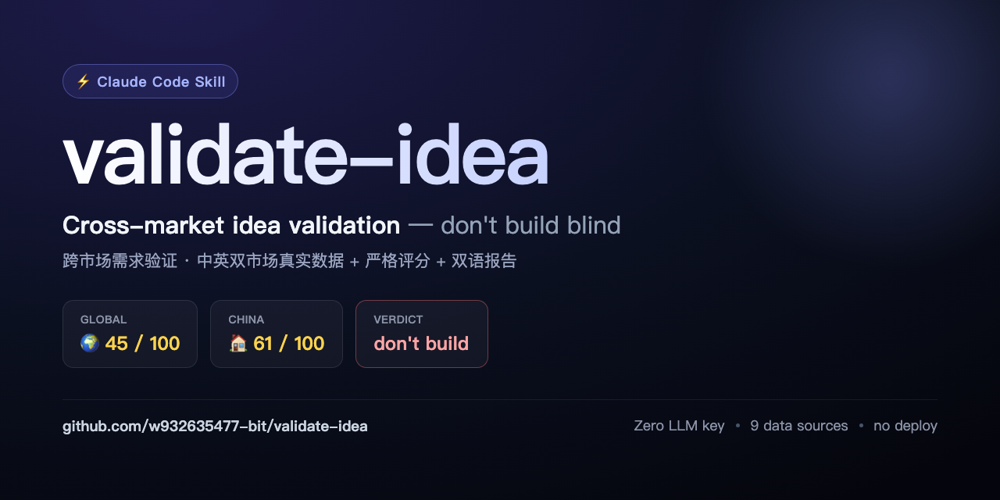
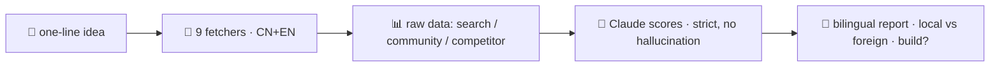

[English](./README.md) | [中文](./README.zh-CN.md)

<p align="center">
  
</p>

<p align="center">
  <strong>Cross-market idea validation for indie builders.</strong><br>
  Real data from Chinese + English markets · strict scoring · bilingual report.
</p>

<p align="center">
  <a href="./LICENSE"></a>
  
  
  
</p>

---

## The killer angle

Most idea-validation tools look at **one** market. This one pulls real signals from **both** the Chinese and English markets at once, then tells you the uncomfortable truth: **your pain is probably already solved in the other market.** Real demand ≠ real opportunity.

> Sample verdict — *cross-border payments tool*: Global **45/100**, China **61/100** → both red oceans → **don't build**. Three months of code, saved.

## Install (Claude Code skill)

```bash
git clone https://github.com/w932635477-bit/validate-idea.git ~/.claude/skills/validate-idea
cd ~/.claude/skills/validate-idea && npm install   # one-time
```

Then just describe your idea in Claude Code ("validate this idea: …") and the skill fires. **Zero LLM API key** — the Claude running the skill *is* the scorer.

## How it works



This repo ships the **data layer** only: 9 fetchers covering search / community / competitor across both markets. Scoring and the bilingual report are produced by your Claude reading the fetched JSON — that's why no API key is needed.

## Data sources

| Dimension | Chinese market | English market |
|---|---|---|
| search | Firecrawl | Firecrawl |
| community | Zhihu (cookie) | HN / Lobsters / pullpush (Reddit) |
| competitor | Baidu | Brave (key) + HN Show HN fallback |

Every fetcher fails independently (`ok:false`) and never blocks the others. Missing data is reported honestly, never invented.

## Sample reports

Real runs in [`docs/demos/`](./docs/demos):
- **Cross-border payments** — don't build (Global 45 / China 61, both red oceans)
- **AI weekly report** — build, but China only
- **AI PR review bot** — don't build (giants + open source + platform-native)
- **Interview repo quarantine** — real pain (DPRK "Contagious Interview"), but Socket.dev already owns it → niche wedge only

## Configure (all optional)

```bash
cp .env.example .env   # fill what you have; missing sources just degrade
```

- `FIRECRAWL_API_KEY` — search dimension (both markets). Recommended, best data.
- `ZHIHU_COOKIE` — Chinese community (Zhihu).
- `HTTPS_PROXY` — needed in China to reach English sources.
- `BRAVE_SEARCH_API_KEY` — English competitors (HN Show HN backstops if absent).

## FAQ

- **The skill doesn't trigger** — restart Claude Code so it rescans `~/.claude/skills/`.
- **English sources return nothing** — set `HTTPS_PROXY` if you're behind the GFW.
- **Zhihu returns 403** — Zhihu anti-scrape; paste a fresh login cookie into `ZHIHU_COOKIE`.
- **A dimension scores very low** — by design: missing data forces a low score (no inventing). Fill the relevant key in `.env`.

## Honest notes

- English sources need a proxy inside China; without it the English dim is thin (flagged honestly).
- Data-poor dimensions are forced low — prevents the "no data → medium score" delusion.
- The report is decision support, not the decision.

## Tech

`cheerio` + `undici` + `zod` + `tsx`. No frontend, no deploy, no LLM calls.

---

MIT © [w932635477-bit](https://github.com/w932635477-bit)
