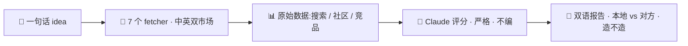

[English](./README.md) | [中文](./README.zh-CN.md)

<p align="center">
  
</p>

<p align="center">
  <strong>给独立开发者的跨市场需求验证。</strong><br>
  中英双市场真实数据 · 严格评分 · 双语报告。
</p>

<p align="center">
  <a href="./LICENSE"></a>
  
  
  
</p>

---

## 杀手点

多数 idea 验证工具只看一个市场。这个同时扒**中文 + 英文**两个市场的真实信号,然后告诉你扎心的真相:**你的痛,大概率在另一个市场早被解决了。** 需求真实 ≠ 机会真实。

> 示例结论 —— *出海收款工具*:全球 **45/100**、中国 **61/100** → 两边红海 → **别造**。三个月代码,省了。

## 安装(Claude Code skill)

```bash
git clone https://github.com/w932635477-bit/validate-idea.git ~/.claude/skills/validate-idea
cd ~/.claude/skills/validate-idea && npm install   # 一次性
```

装好后在 Claude Code 里直接描述你的 idea("帮我验证这个 idea:……")就会自动触发。**零 LLM API key** —— 跑这个 skill 的 Claude 本身就是评分引擎。

## 工作原理



本仓库只提供**数据抓取层**:7 个 fetcher 覆盖中英两市场的 search / community / competitor 三维。评分和双语报告由你的 Claude 读抓回的 JSON 生成 —— 所以不需要任何 API key。

## 数据源

| 维度 | 中文市场 | 英文市场 |
|---|---|---|
| search | Firecrawl | Firecrawl |
| community | 知乎(cookie) | HN / Lobsters / pullpush(reddit) |
| competitor | 百度 | Brave(key)+ HN Show HN 兜底 |

每个 fetcher 失败独立 catch(返回 `ok:false`),不阻塞其他源。数据缺失如实标注,绝不编造。

## 示例报告

真实跑出来的报告在 [`docs/demos/`](./docs/demos):
- **出海收款** —— 别造(全球 45 / 中国 61,两边红海)
- **AI 周报** —— 造,但只造中国
- **AI PR review bot** —— 别造(巨头 + 开源 + 平台原生三重碾压)
- **面试仓库安全报告** —— 痛真实(朝鲜 Contagious Interview),但 Socket.dev 已占 → 只剩窄缝

## 配置(全可选)

```bash
cp .env.example .env   # 按需填,缺了对应源就优雅降级
```

- `FIRECRAWL_API_KEY` —— search 维度(两市场)。建议填,数据质量最好。
- `ZHIHU_COOKIE` —— 中文社区(知乎)。
- `HTTPS_PROXY` —— 在中国抓英文源要经本地代理。
- `BRAVE_SEARCH_API_KEY` —— 英文竞品(无 key 时 HN Show HN 兜底)。

## 常见问题

- **skill 没被触发** —— 重启 Claude Code,让它重扫 `~/.claude/skills/`。
- **英文源全部空** —— 在墙内需设 `HTTPS_PROXY`。
- **知乎返 403** —— 知乎反爬;把新鲜登录 cookie 填进 `ZHIHU_COOKIE`。
- **某维度分数特别低** —— 设计如此:数据缺失强制低分(不臆测)。在 `.env` 填对应 key。

## 诚实声明

- EN 源在中国需代理,否则英文维度数据贫瘠(如实标注,不编)。
- 数据缺失的维度强制低分 —— 防止"没数据就臆测中等分"的自欺。
- 报告是决策辅助,不是决策本身。

## 技术栈

`cheerio` + `undici` + `zod` + `tsx`。无前端、无部署、无 LLM 调用。

---

MIT © [w932635477-bit](https://github.com/w932635477-bit)
